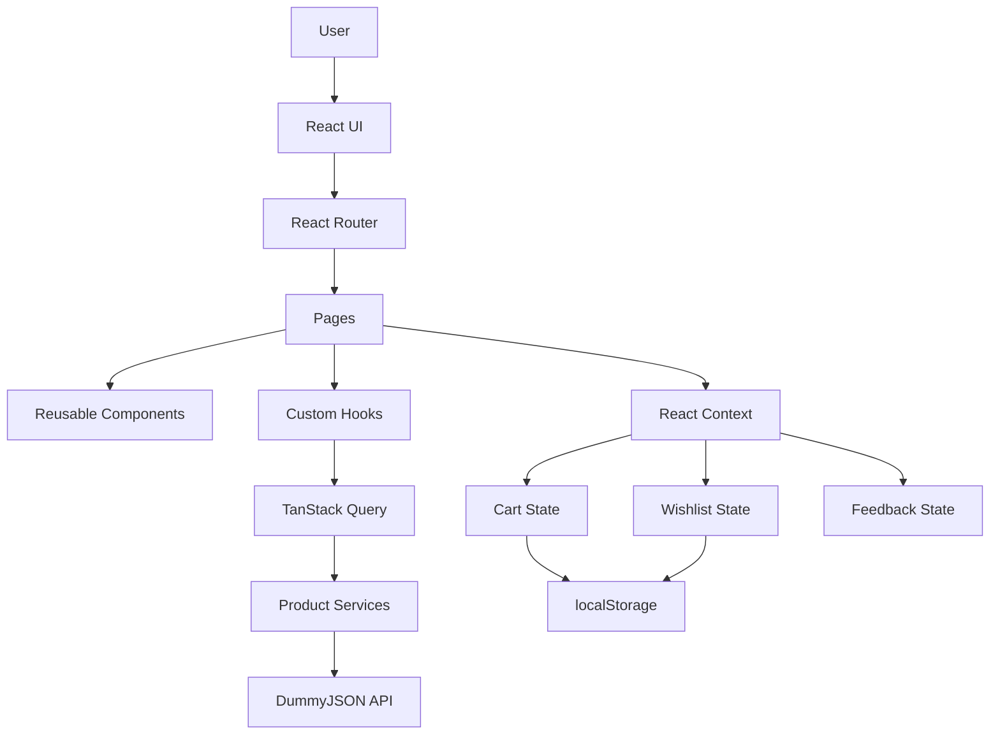

# 🛍️ ShopSphere

<p align="center">
  <strong>A modern, responsive e-commerce storefront built with React.</strong>
</p>

<p align="center">
  Product discovery · Search · Filtering · Sorting · Pagination · Product details · Cart · Wishlist · Persistence · Accessibility · Testing
</p>

<p align="center">

<a href="https://github.com/RakshatTiwari/shopsphere">
  
</a>


</p>

<p align="center">


</p>

---

## 📖 Overview

**ShopSphere** is a portfolio-oriented e-commerce frontend built to demonstrate practical, production-style React development.

The application provides a complete storefront experience covering the journey from **product discovery → search → filtering → product details → cart/wishlist management**, while maintaining a clean component architecture and separation between server state and client state.

The project uses the **DummyJSON API** as its product data source and combines **React**, **React Router**, **TanStack Query**, **React Context**, **Vite**, **Vitest**, and **React Testing Library** to build and validate the application.

### What ShopSphere demonstrates

* Modern React component architecture
* Client-side routing
* REST API integration
* Server-state management
* Client-side state management
* Persistent browser state
* Search and product discovery
* Multi-criteria filtering
* Sorting and pagination
* Product detail experiences
* Cart calculations
* Wishlist management
* Responsive design
* Accessibility considerations
* Loading and error handling
* Request cancellation
* Automated component/context testing
* Production build workflows
* Structured Git development

---

# ✨ Features

## 🛍️ Product Discovery

* Product catalog
* Product search
* Category browsing
* Category filtering
* Minimum price filtering
* Maximum price filtering
* Rating filtering
* Product sorting
* Client-side pagination
* Result counts
* Empty-result handling

---

## 🔎 Search

Search is integrated directly into the storefront navigation.

Search state is represented through the URL, allowing search results to work naturally with browser navigation.

Example:

```text
/products?search=phone
```

The catalog adapts its presentation based on the active search query.

---

## 📦 Product Details

Every product has a dedicated details page.

Product details include:

* Product title
* Category
* Description
* Price
* Discount percentage
* Rating
* Stock information
* Product images
* Image gallery
* Quantity selection
* Add-to-cart action
* Wishlist action

Route:

```text
/products/:productId
```

---

## 🛒 Shopping Cart

The cart provides a complete client-side shopping workflow.

Users can:

* Add products
* Add specific quantities
* Increase quantities
* Decrease quantities
* Remove products
* Clear the cart
* View subtotal
* View shipping
* View tax
* View final total
* Track free-shipping progress

Cart quantities are constrained by the available product stock.

---

## 💰 Cart Calculations

The cart automatically derives its financial values.

### Subtotal

```text
Σ(product price × quantity)
```

### Shipping

A free-shipping threshold is applied when the cart subtotal reaches the configured threshold.

Otherwise, a standard shipping charge is applied.

### Tax

Tax is calculated from the cart subtotal.

### Final Total

```text
Subtotal + Shipping + Tax
```

Currency calculations are rounded to two decimal places.

---

## ❤️ Wishlist

The wishlist allows users to save products for later.

Users can:

* Add products to the wishlist
* Remove products
* Toggle wishlist state
* Clear the wishlist
* View saved products

Wishlist state is persisted between browser sessions.

---

## 💾 Persistent State

ShopSphere persists cart and wishlist state using browser `localStorage`.

This allows users to:

1. Add products to their cart or wishlist
2. Navigate through the application
3. Refresh the browser
4. Return later

without immediately losing their client-side state.

A small storage abstraction handles:

* Reading values
* Writing values
* Removing values
* JSON serialization
* Invalid-storage fallbacks

Storage keys are namespaced under:

```text
shopsphere:
```

---

# ⚡ Server-State Management

Product-related asynchronous data is managed using **TanStack Query**.

This provides:

* Query caching
* Loading states
* Error states
* Stale-data management
* Query lifecycle handling
* Request cancellation
* Reusable query hooks

The data flow is intentionally separated from presentation components.

```text
Component
    ↓
Custom Hook
    ↓
TanStack Query
    ↓
Service Function
    ↓
DummyJSON API
```

---

# 🔄 Request Cancellation

Product queries receive the `AbortSignal` provided by TanStack Query.

This allows obsolete requests to be cancelled when query state changes.

For example:

```text
User searches "phone"
        ↓
Request A starts
        ↓
User changes search to "laptop"
        ↓
Request B starts
        ↓
Request A can be cancelled
```

This helps prevent unnecessary network work and keeps asynchronous query behavior aligned with the current UI state.

---

# 🧠 State Management Strategy

ShopSphere intentionally separates **server state** from **client state**.

## Server State

Managed using **TanStack Query**.

Includes:

* Products
* Search results
* Categories
* Product details
* Loading state
* Error state
* Cached queries
* Request lifecycle

## Client State

Managed using **React Context** and reducers.

Includes:

* Shopping cart
* Wishlist
* Feedback notifications

This keeps each state-management mechanism focused on the type of state it is designed to handle.

---

# 🏗️ Architecture



### Architectural responsibilities

### Pages

Pages are responsible for:

* Route-level UI
* Page composition
* Connecting application state to UI
* Coordinating page-specific interactions

### Components

Reusable components handle interface elements such as:

* Navigation
* Search
* Product cards
* Product grids
* Filters
* Sorting
* Pagination
* Cart UI
* Wishlist UI
* Feedback notifications

### Hooks

Custom hooks provide reusable access to:

* Product queries
* Category queries
* Cart state
* Wishlist state

### Contexts

React Context manages application-wide client state:

* Cart
* Wishlist
* Feedback

### Services

API communication is isolated inside service functions.

This keeps network-specific implementation details out of presentation components.

### Router

React Router handles:

* Page navigation
* Dynamic product routes
* Nested layout rendering
* Not-found handling

---

# 📂 Project Structure

```text
shopsphere/
│
├── public/
│   └── favicon.svg
│
├── src/
│   │
│   ├── components/
│   │   │
│   │   ├── catalog/
│   │   │   ├── Pagination.jsx
│   │   │   └── SortSelect.jsx
│   │   │
│   │   ├── feedback/
│   │   │   ├── FeedbackToast.css
│   │   │   └── FeedbackToast.jsx
│   │   │
│   │   ├── filters/
│   │   │   ├── CategoryFilter.jsx
│   │   │   ├── FilterSidebar.jsx
│   │   │   ├── PriceFilter.jsx
│   │   │   └── RatingFilter.jsx
│   │   │
│   │   ├── layout/
│   │   │   └── AppLayout.jsx
│   │   │
│   │   ├── navigation/
│   │   │   └── Navbar.jsx
│   │   │
│   │   ├── products/
│   │   │   ├── __tests__/
│   │   │   │   └── ProductCard.test.jsx
│   │   │   ├── ProductCard.jsx
│   │   │   ├── ProductGallery.jsx
│   │   │   └── ProductGrid.jsx
│   │   │
│   │   └── search/
│   │       └── SearchBar.jsx
│   │
│   ├── constants/
│   │   └── api.js
│   │
│   ├── context/
│   │   ├── __tests__/
│   │   │   ├── CartContext.test.jsx
│   │   │   └── WishlistContext.test.jsx
│   │   │
│   │   ├── cartContextValue.js
│   │   ├── CartContext.jsx
│   │   ├── feedbackContext.js
│   │   ├── FeedbackContext.jsx
│   │   ├── wishlistContextValue.js
│   │   └── WishlistContext.jsx
│   │
│   ├── hooks/
│   │   ├── useCart.js
│   │   ├── useCategories.js
│   │   ├── useFeedback.js
│   │   ├── useProduct.js
│   │   ├── useProducts.js
│   │   ├── useSearchProducts.js
│   │   └── useWishlist.js
│   │
│   ├── pages/
│   │   ├── CartPage.jsx
│   │   ├── HomePage.css
│   │   ├── HomePage.jsx
│   │   ├── NotFoundPage.jsx
│   │   ├── ProductDetailsPage.css
│   │   ├── ProductDetailsPage.jsx
│   │   ├── ProductsPage.jsx
│   │   └── WishlistPage.jsx
│   │
│   ├── services/
│   │   └── productService.js
│   │
│   ├── test/
│   │   └── setup.js
│   │
│   ├── utils/
│   │   └── storage.js
│   │
│   ├── App.jsx
│   ├── index.css
│   ├── main.jsx
│   └── router.jsx
│
├── .gitignore
├── eslint.config.js
├── index.html
├── package-lock.json
├── package.json
├── README.md
├── vite.config.js
└── vitest.config.js
```

---

# 🧭 Application Routes

| Route                  | Purpose         |
| ---------------------- | --------------- |
| `/`                    | Home page       |
| `/products`            | Product catalog |
| `/products/:productId` | Product details |
| `/wishlist`            | Saved products  |
| `/cart`                | Shopping cart   |
| `*`                    | Not-found page  |

---

# 🏠 Home Page

The home page acts as the primary entry point to the storefront.

It includes:

* Hero section
* Product discovery entry points
* Category discovery
* Featured products
* Calls to action
* Responsive presentation
* Loading handling
* Error handling

The page is designed to move users naturally from discovery into the product catalog.

---

# 🛍️ Product Catalog

The catalog is the central product discovery interface.

Users can:

```text
Search
   ↓
Filter
   ↓
Sort
   ↓
Paginate
   ↓
Open Product
   ↓
Add to Cart / Wishlist
```

### Filtering

Available filters include:

* Category
* Minimum price
* Maximum price
* Minimum rating

### Sorting

Available sorting options include:

* Relevance
* Price — low to high
* Price — high to low
* Rating

### Pagination

Products are presented in paginated groups to keep the catalog manageable and easy to scan.

---

# 🖼️ Product Presentation

Each product card communicates the most important information at a glance:

* Product image
* Category
* Product name
* Rating
* Price
* Discount
* Stock status

Product cards also provide direct navigation to the corresponding product details page.

---

# 🛒 Cart Architecture

Cart state is managed through React Context and a reducer.

Core reducer operations include:

```text
ADD_ITEM
UPDATE_QUANTITY
REMOVE_ITEM
CLEAR_CART
```

The cart exposes derived values including:

```text
Cart item count
       ↓
Subtotal
       ↓
Shipping
       ↓
Tax
       ↓
Final total
```

The reducer ensures quantities cannot exceed the available stock.

---

# ❤️ Wishlist Architecture

Wishlist state is managed independently from cart state.

This keeps the two shopping concepts isolated while allowing both to be consumed by the navigation, product cards, product details, and dedicated wishlist page.

---

# 🌐 API Integration

ShopSphere uses the **DummyJSON API** as its product data source.

API base URL:

```text
https://dummyjson.com
```

The application isolates API communication inside:

```text
src/services/productService.js
```

UI components do not directly implement API request logic.

This provides a clean separation:

```text
UI
 ↓
Hooks
 ↓
Query Layer
 ↓
Service Layer
 ↓
External API
```

---

# 🧪 Testing Strategy

The project uses:

* **Vitest** for test execution
* **React Testing Library** for user-oriented component testing
* **jest-dom** for DOM assertions

Tests focus on observable behavior rather than implementation details.

## Current automated coverage

### ProductCard

Tests cover:

* Product information rendering
* Product detail navigation
* Discount rendering
* Rating rendering
* In-stock state
* Out-of-stock state

### CartContext

Tests cover:

* Empty cart state
* Adding products
* Requested quantity
* Stock limits
* Quantity updates
* Product removal
* Cart clearing
* Derived cart values

### WishlistContext

Tests cover:

* Empty wishlist state
* Adding products
* Toggle behavior
* Removing products
* Clearing wishlist
* Wishlist membership state

---

# 📊 Current Test Suite

The current automated suite contains:

```text
3 test files
12 tests
12 passing
```

Run it with:

```bash
npm run test
```

---

# 🧹 Code Quality

ESLint is used for static analysis and code-quality validation.

Run:

```bash
npm run lint
```

The project is expected to pass linting before changes are committed.

---

# 🏗️ Production Build

Build the production bundle with:

```bash
npm run build
```

Preview the production build locally with:

```bash
npm run preview
```

---

# 📱 Responsive Design

ShopSphere is designed for:

* 📱 Mobile
* 📲 Tablet
* 🖥️ Desktop

Responsive behavior includes:

* Adaptive navigation
* Flexible product grids
* Responsive catalog layout
* Mobile-friendly filtering
* Responsive cart layout
* Responsive wishlist layout
* Flexible spacing
* Adaptive typography
* Touch-friendly controls

The interface is designed so core shopping workflows remain usable across viewport sizes.

---

# ♿ Accessibility

Accessibility is considered throughout the interface.

The application includes:

* Semantic HTML
* Descriptive navigation links
* Accessible button names
* Alternative text for product images
* Keyboard-focus states
* Accessible labels
* Meaningful status messaging
* Logical content hierarchy
* Appropriate interactive elements
* Screen-reader-friendly information

Accessibility is treated as part of the component implementation rather than as a final-stage addition.

---

# 🎨 UI Design Principles

ShopSphere follows a clean, modern e-commerce visual language.

The interface prioritizes:

* Clear visual hierarchy
* Consistent spacing
* Strong typography
* Readable product information
* Clear pricing
* Visible stock states
* Consistent interactive states
* Predictable navigation
* Responsive layouts
* Minimal visual clutter

The CSS architecture uses reusable patterns and shared design rules to maintain consistency throughout the application.

---

# ⚡ Performance Considerations

The project incorporates several frontend performance techniques.

### TanStack Query caching

Repeated server requests can benefit from query caching.

### Request cancellation

Obsolete product requests can be cancelled through `AbortSignal`.

### Lazy-loaded images

Product images use lazy loading where appropriate.

### Memoized derived values

Derived product lists, filtering/sorting results, cart calculations, and context values are memoized where beneficial.

### Client-side pagination

Only the visible product subset is rendered on each catalog page.

These techniques aim to reduce unnecessary work while keeping the architecture understandable and maintainable.

---

# 🔐 Data & Security Scope

ShopSphere is a frontend portfolio application.

It does **not** currently implement:

* User authentication
* Real customer accounts
* Payment processing
* Real order placement
* Backend inventory management
* Sensitive personal-data storage
* Server-side cart persistence

Cart and wishlist information is stored locally in the browser.

The DummyJSON API is used as a demonstration product-data source.

---

# 🔁 Main User Flow

```text
                    ┌───────────────┐
                    │     Home      │
                    └───────┬───────┘
                            │
                            ▼
                  ┌──────────────────┐
                  │ Product Catalog  │
                  └────────┬─────────┘
                           │
              ┌────────────┼────────────┐
              ▼            ▼            ▼
           Search       Filter        Sort
              │            │            │
              └────────────┼────────────┘
                           ▼
                  ┌──────────────────┐
                  │ Product Details  │
                  └────────┬─────────┘
                           │
                 ┌─────────┴─────────┐
                 ▼                   ▼
            Add to Cart       Add to Wishlist
                 │                   │
                 ▼                   ▼
             ┌───────┐          ┌──────────┐
             │ Cart  │          │ Wishlist │
             └───────┘          └──────────┘
```

---

# 🧩 Key Engineering Decisions

## Why React Context for Cart and Wishlist?

Cart and wishlist state is shared across multiple unrelated components.

React Context provides a lightweight global client-state solution without introducing an unnecessary state-management dependency.

---

## Why TanStack Query?

Product information is server state rather than application-owned client state.

TanStack Query provides purpose-built mechanisms for:

* Caching
* Loading states
* Error states
* Stale data
* Query lifecycle
* Request cancellation

---

## Why Separate API Services?

API calls are isolated from UI components.

Instead of embedding network logic inside components:

```text
Component
    ↓
Hook
    ↓
Service
    ↓
API
```

This improves:

* Separation of concerns
* Maintainability
* Reusability
* Testability

---

## Why localStorage?

Cart and wishlist persistence provides a more realistic storefront experience while remaining appropriate for a frontend-only portfolio project.

---

## Why URL-Based Search State?

Keeping search state in the URL provides better browser navigation behavior and allows search results to be represented by a shareable route.

---

# 🛠️ Tech Stack

| Technology            | Role                                     |
| --------------------- | ---------------------------------------- |
| React 19              | UI development                           |
| React Router 8        | Client-side routing                      |
| TanStack Query 5      | Server-state management                  |
| React Context         | Client-state management                  |
| Vite 8                | Development and production build tooling |
| Vitest 5              | Test runner                              |
| React Testing Library | Component testing                        |
| jest-dom              | DOM assertions                           |
| ESLint 10             | Static analysis                          |
| DummyJSON             | Product API                              |
| localStorage          | Client-side persistence                  |
| CSS                   | Responsive UI styling                    |

---

# 🚀 Getting Started

## Prerequisites

Make sure the following are installed:

* Node.js
* npm
* Git

## Clone the repository

```bash
git clone https://github.com/RakshatTiwari/shopsphere.git
cd shopsphere
```

## Install dependencies

```bash
npm install
```

## Start the development server

```bash
npm run dev
```

Vite will display the local development URL in the terminal.

---

# 📜 Available Scripts

| Command           | Purpose                      |
| ----------------- | ---------------------------- |
| `npm run dev`     | Start the development server |
| `npm run build`   | Create a production build    |
| `npm run preview` | Preview the production build |
| `npm run lint`    | Run ESLint                   |
| `npm run test`    | Run the automated test suite |

---

# 🧪 Development Validation

Before committing changes, the project can be validated using:

```bash
npm run lint
npm run test
npm run build
```

A healthy development cycle should result in:

```text
Lint       ✓
Tests      ✓
Build      ✓
Git Status ✓
```

---

# 📸 Screenshots & Demo

Screenshots can be added here as the project evolves.

Recommended showcase images:

1. Home page
2. Product catalog
3. Search results
4. Filtered catalog
5. Product details
6. Cart
7. Wishlist
8. Mobile responsive view

Example structure:

```text
docs/
└── screenshots/
    ├── home.png
    ├── catalog.png
    ├── product-details.png
    ├── cart.png
    ├── wishlist.png
    └── mobile.png
```

Once screenshots are added, they can be displayed directly in this section.

---

# 🎬 Demo

The project can be demonstrated through the complete shopping workflow:

```text
Home
  ↓
Browse Products
  ↓
Search / Filter / Sort
  ↓
Open Product
  ↓
Select Quantity
  ↓
Add to Cart
  ↓
Review Cart
  ↓
Update Quantity
  ↓
View Calculations
```

Wishlist functionality can be accessed independently from product cards and product detail pages.

---

# 🛣️ Future Improvements

Potential future iterations include:

* User authentication
* User profiles
* Backend integration
* Real inventory management
* Checkout workflow
* Payment integration
* Order history
* Product reviews
* Product recommendations
* Recently viewed products
* Coupon support
* Server-side pagination
* Advanced server-side filtering
* Persistent backend carts
* End-to-end testing
* Continuous integration
* Continuous deployment
* Production hosting
* Performance monitoring

These are intentionally outside the current frontend-only scope.

---

# 🔄 Git Development Workflow

The project is developed through incremental, meaningful commits.

Commit types include:

```text
feat:
fix:
refactor:
perf:
test:
docs:
```

Examples:

```text
feat: add product catalog
feat: add shopping cart
feat: add wishlist persistence
fix: improve responsive storefront layouts
fix: improve storefront accessibility
perf: support cancelable product queries
test: add storefront behavior coverage
docs: add project documentation
```

The objective is to maintain a readable development history where commits correspond to actual engineering milestones rather than artificial changes.

---

# 🎯 Portfolio Goals

ShopSphere was built to demonstrate practical frontend engineering capabilities relevant to modern React development.

The project demonstrates experience with:

* Component-driven architecture
* React hooks
* Client-side routing
* REST API integration
* Server-state management
* Client-state management
* Reducer-based state updates
* Browser persistence
* Responsive CSS
* Accessibility
* Loading and error states
* Performance considerations
* Automated testing
* Production builds
* Git workflows
* Maintainable project organization

The focus is not only on creating a visually appealing storefront, but also on demonstrating the engineering decisions behind it.

---

# 📚 Learning & Engineering Outcomes

Through this project, the following frontend engineering concepts are demonstrated:

### Architecture

* Separation of UI and data access
* Reusable component design
* Route-level page composition
* Layered frontend architecture

### State Management

* React Context
* Reducers
* Derived state
* Server vs client state separation
* Persistent browser state

### Networking

* REST API integration
* Query caching
* Request lifecycle management
* Request cancellation

### UI Engineering

* Responsive layouts
* Reusable CSS patterns
* Interactive states
* Empty states
* Loading states
* Error states

### Quality

* Automated testing
* Accessibility
* ESLint
* Production builds
* Incremental Git history

---

# 📄 Author

Rakshat Tiwari